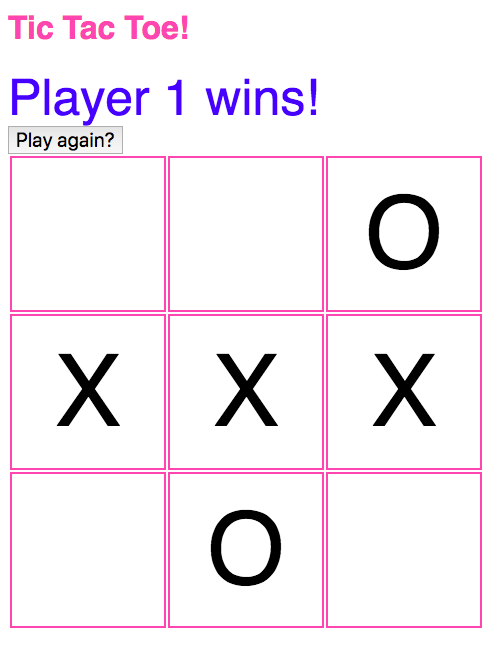

# Tic-Tac-Toe

Tech test completed during Week 10 at Makers Academy.

## The brief

The rules of tic-tac-toe are as follows:

* There are two players in the game (X and O)
* Players take turns until the game is over
* A player can claim a field if it is not already taken
* A turn ends when a player claims a field
* A player wins if they claim all the fields in a row, column or diagonal
* A game is over if a player wins
* A game is over when all fields are taken

Build the business logic for a game of tic tac toe. It should be easy to implement a working game of tic tac toe by combining your code with any user interface, whether web or command line.

## My Approach

I decided to start by test-driving the game logic for this application. After writing the first couple of tests I then began implementing the User Interface. This guided the design of my application and helped me understand which methods were necessary in the back-end to ensure the front-end worked as desired.

## How to run my code

* `git clone` https://github.com/imogenmisso/Tic-Tac-Toe
* run `open src/index.html`
* to run the tests: `open SpecRunner.html`

## What it looks like!

